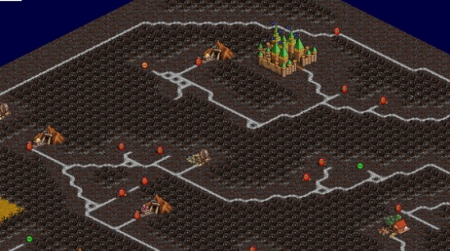

# **Как запустить**
[Проект](https://github.com/Mopchik/MapGenerator) можно запустить тремя способами:

- Скачать jar-файл и запустить его командой

`	`java –jar MapGenerator.jar

- Скачать весь проект и собрать его командой:

`	    `/gradlew :runJvm      # for Linux/Mac

.   	     \gradlew.bat :run       # for Windows

- Скачать весь проект, открыть его и запустить из Intellij Idea

Входные данные: ввод осуществляется через консольное взаимодействие. Программа сама предложит ввести количество игроков и размер карты, никакие входные параметры при запуске не требуются. При запуске программы вторым способом указать количество игроков и размер карты не получится, они возьмутся случайными.

Вывод: в результате работы программы в папке расположения jar-файла / в папке проекта появится файл map.hmm. Чтобы его посмотреть, надо будет открыть его в [рекдакторе карт](https://github.com/SerVB/pph). Редактор карт должен быть отдельно установлен. Сделать это можно по ссылке:

[Release Initial version · SerVB/pph-native · GitHub](https://github.com/SerVB/pph-native/releases/tag/initial)

#
# **Описание проекта**
Мой проект – это генератор случайных карт для игры Pocket Palm Heroes. Моё приложение должно было с нуля по каким-то заданным параметрам выдавать файл формата .hmm – готовую карту, которую впоследствии можно запустить [в редакторе карт](https://github.com/SerVB/pph) и потенциально запустить [в самой игре](https://github.com/SerVB/pph).

За основу работу генератора карты были взяты силовые алгоритмы размещения графа на карте: дорога на моей карте – это и есть граф. 

В результате мне удалось создать генератор случайной карты для заданных или случайных количества игроков и размера карты. Написана программа на языке Kotlin. 

# **Основные шаги генерации карты**
Моя программа работает в несколько этапов.
## **Генерация случайного графа**
Сначала создаётся система дорог карты, представляющая из себя граф из случайно выбранного количества вершин, зависящего от размера карты, и случайно генерируемых рёбер с оптимизацией: граф связный и степень одной вершины стремится быть не слишком больше двух-трёх.
## **Размещение графа на плоскости**
В качестве вершин графа выбираются точки с координатами в пределах карты. Сначала эти точки выбираются случайным образом, но затем к ним в течение ста итераций применяется силовой алгоритм размещения графа, в результате они упорядочиваются, равномерно распределяясь по карте и образовывая приятную для взгляда систему дорог.
## **Силовые алгоритмы размещения графа**
В проекте использованы силовые алгоритмы, описанные в [данной работе](https://ppt-online.org/55733). 

Во-первых, это алгоритм Фрюхтермана и Рейнгольда, но в котором значения сил притяжения и отталкивания я подобрал сам таким образом, чтобы улучшить картинку графа. В алгоритме есть модификация в виде применения температуры, но я убедился, что применение этой модификацией необходимо, без неё всё работает не так, но об этом далее. 

Во-вторых, я взял доработку алгоритма Фрюхтермана и Рейнгольда в виде алгоритма Frick-а. Он добавляет к силам притяжения и отталкивания силу гравитации, не дающий вершинам с высокой степенью разлетаться далеко от центра, в результате получается система дорог, приятная на вид.

Работа алгоритма следующая: вся карта с вершинами дорог представляет из себя физическую систему, где для каждой вершины просчитываются силы, действующие на неё и выдающие силу – вектор, на которой вершина должна изменить свои координаты при текущей итерации. На каждую вершину действует три силы: во-первых, все вершины друг от друга отталкиваются подобно частицам с одноимёнными зарядами. 

Чем ближе они друг к другу, чем сильнее нарушено ‘расстояние покоя', тем больше сила отталкивания; во-вторых, все смежные вершины друг к другу притягиваются подобно тому, если бы они были связаны пружинами, в результате связанные ребром вершины стремятся быть ближе друг к другу; в-третьих, это сила гравитации, действующая тем сильнее на вершину, чем выше у неё степень. 

## **Соединение вершин и генерация объектов**
Полученные вершины друг с другом соединяются (то есть клетки на пути становятся дорогами). В изначальной версии алгоритма на этом этапе я брал в качестве замков случайные вершины полученного графа, а в качестве шахт, артефактов и других объектов – вершины со степенью один. Алгоритм предполагал создание побольше таких вершин со степенью один. Но рисунок получался некрасивым: замки стояли на перекрёстках, а рёбра, прилегающие к вершинам со степенью один зачастую пересекались, не помогло и линейное уменьшение длины таких рёбер. 

Поэтому все объекты на карте выбираются как случайная точка, на которой объект может стоять: то есть у каждого объекта есть его размер, радиус, и в этом радиусе все клетки должны быть свободны. А также свободны должны быть клетки на ближайшем пути объекта к дороге. В случае если объект не замок, он “притягивается’’ к дороге так близко, как это возможно. В случае, если объект замок, он случайно получает тип местности (песок, трава, снег и тп). В дальнейшем тип местности клетки будет определяться типом местности ближайшего к ней замка. 
## **Генерация нейтралов и декораций**
У каждого объекта, который не замок, случайным образом появляется или не появляется защищающие его нейтралы силы, зависящей от значимости объекта. Также нейтралы появляются в вершинах графа дороги, то есть на перекрёстках, это нейтралы средней силы. 

Все свободные поля на карте заполняются декорациями, и карта в результате приобретает завершённый вид. Каждому игроку выделяется по замку, в котором он появится в самом начале игры.

## **Вывод в файл**
Последний этап – всё на карте выводится в файл формата .hmm в виде байт-кода. Файл можно открыть редактором карт.

# **Перспективы работы**
Проект уже может быть внедрён в Pocket Palm Heroes и создавать случайные карты для него. Также он может быть улучшен: хоть моя программа и размещает основные объекты, она размещает не всё, что может быть на карте, включая декорации. Проект может быть доработан и размещать случайным образом все возможные объекты. Далее, мой проект не генерирует воду и острова, но его программа может быть взята за основу для генерации карты с несколькими областями. 
